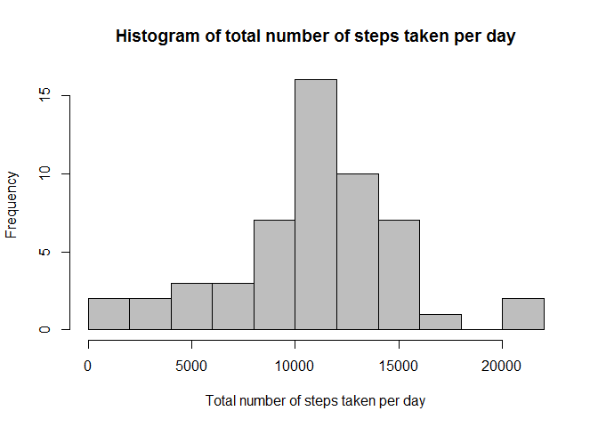
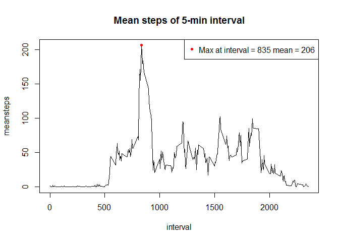
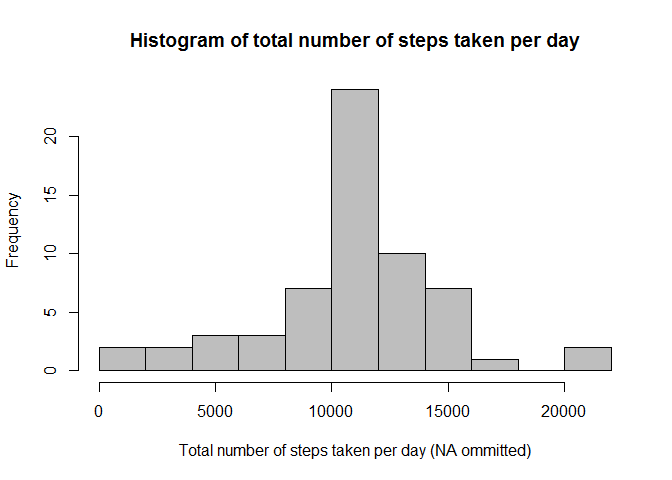

## Loading and preprocessing the data
The required packages lattice and dplyr are loaded for later use.

```r
library(lattice)
library(dplyr)
```

```
## 
## Attaching package: 'dplyr'
```

```
## The following objects are masked from 'package:stats':
## 
##     filter, lag
```

```
## The following objects are masked from 'package:base':
## 
##     intersect, setdiff, setequal, union
```
Depending on whether the file "activity.csv" exists, the unzip is carried out. Then data is read via read.csv function, and the date is transformed to the Date format in R:

```r
if(!file.exists("activity.csv")){
    unzip(zipfile = "activity.zip")
}
dataSet <- read.csv("activity.csv")
dataSet$date <- as.Date(dataSet$date, "%Y-%m-%d")
```
## What is mean total number of steps taken per day?
To answer this question, the data is first grouped by the variable **date**, then using summarise function with embedded call of sum on variable **steps**, to calculate the total number of steps taken per day. Result is stored in an object noStepDay as variable **sum**. 

A histogram is generated to show the distribution, 

```r
noStepDay <- dataSet %>% group_by(date) %>% summarise(sum = sum(steps))
hist(noStepDay$sum, 15, col = "grey", main = "Histogram of total number of steps taken per day", xlab = "Total number of steps taken per day")
```

<!-- -->

and the mean and median of the total number of steps per day are 10766 and 10765, respectively.

```r
summary(noStepDay$sum)
```

```
##    Min. 1st Qu.  Median    Mean 3rd Qu.    Max.    NA's 
##      41    8841   10765   10766   13294   21194       8
```

## What is the average daily activity pattern?
Instead of grouping the data by date, it is now grouped by interval. In a similar way, after calling summarise function with mean, we get the mean of total number of steps per interval.

Note that the NA values are ignored. 

Results are stored in *noStepItv* object, and a plot is generated to show the data

```r
noStepItv<- dataSet[!is.na(dataSet$steps),] %>% group_by(interval)%>% summarise(meansteps = mean(steps))
with(noStepItv, plot(interval, meansteps, type = "l", main = "Mean steps of 5-min interval") )
points(noStepItv[which.max(noStepItv$meansteps),], pch = 20, col = "red")
text1 <- paste0("Max at interval = ", as.character(noStepItv[which.max(noStepItv$meansteps),"interval"]))
text2 <- paste0("mean = ", as.character(round(noStepItv[which.max(noStepItv$meansteps),"meansteps"])))
text = paste(text1, text2, sep = " ")
legend("topright", pch = 20, legend = text, col = "red")
```

<!-- -->
The **interval** that has the max mean steps is hilighted in the plot: at interval 835, with mean steps 206.

## Imputing missing values
Now lets use a different stratgy to handling missing values instead of simply ignoring them. Here 

1. Calculate and report the total number of missing values in the dataset (i.e. the total number of rows with NAs).
There are a total number of 2304 missing values:

```r
missingSteps <- which(is.na(dataSet$steps))
length(missingSteps)
```

```
## [1] 2304
```

2. Devise a strategy for filling in all of the missing values in the dataset. 
The missing values at a certain interval are replaced by the mean value of that **interval**.

3. Create a new dataset that is equal to the original dataset but with the missing data filled in.

```r
dataSetNew <- dataSet
for (ind in missingSteps){
    dataSetNew[ind, "steps"] <- noStepItv[noStepItv$interval == dataSetNew[ind,"interval"],"meansteps"]
}
```

4. Make a histogram of the total number of steps taken each day and Calculate and report the mean and median total number of steps taken per day. 
    
    After the missing values have been replaced, a new dataset is grouped by date, and the total number of steps per day is obtained by calling summarise function with embedded sum.  Since the NAs are replaced by the mean values, it is expcted that the occurances of total number of steps per day equal to the mean would be more than the case where NAs were simply ignored. This is observarable in the new histogram. 
    
    Moreover, the median and the mean of the new data are 10766 and 10766 respectively. The mean is equal and the median has increased, and this is also because we have replaced the NAs with mean values. 

```r
noStepDayNew <- dataSetNew %>% group_by(date) %>% summarise(sum = sum(steps))
hist(noStepDayNew$sum, 15, col = "grey", main = "Histogram of total number of steps taken per day", xlab = "Total number of steps taken per day (NA ommitted)")
```

<!-- -->

```r
summary(noStepDayNew$sum)
```

```
##    Min. 1st Qu.  Median    Mean 3rd Qu.    Max. 
##      41    9819   10766   10766   12811   21194
```
## Are there differences in activity patterns between weekdays and weekends?
1. Create a new factor variable in the dataset with two levels ¨C ¡°weekday¡± and ¡°weekend¡± indicating whether a given date is a weekday or weekend day.

    We first calculate the day of week and form a new variable **wday** in the object *dataSetNew* without NAs where **wday** values are either "weekday" or "weekend":

```r
dataSetNew <- mutate(dataSetNew, wday = ifelse(as.POSIXlt(dataSetNew$date)$wday ==0 |as.POSIXlt(dataSetNew$date)$wday ==6, "weekend", "weekday"))
```

2. Make a panel plot containing a time series plot (i.e. \color{red}{\verb|type = "l"|}type="l") of the 5-minute interval (x-axis) and the average number of steps taken, averaged across all weekday days or weekend days (y-axis).

    The data is grouped first by **wday** and then by **interval** so that we can easily obtain the mean steps per interval for a particular type of day. After calling summarise with mean function, a new object *noStepItvWd* with **meansteps** variable holding the values of interest:

```r
noStepItvWd<- dataSetNew %>% group_by(wday, interval)%>% summarise(meansteps = mean(steps))
xyplot(meansteps ~ interval | wday, data = noStepItvWd, layout = c(1, 2), type = "l", xlab = "Interval", ylab = "Number of steps")
```

<!-- -->
    
This figure shows that:

* during weekdays, people walk the most in the moring around 8:00 to 9:30, most likely because of rush hours for work. The mean steps have later peaks around lunch time (not as many as morning because not everyone walk outside for lunch) and later peaks in the afternoon most because people go off work but in more distributed hourse.

* during weekends, the steps are more evenly distributed during the day than on weekdays, because the activities of different people can be quite different. Also, the steps start to grow up later and vanish later, because people wake up later and have more night activities on weekends.
